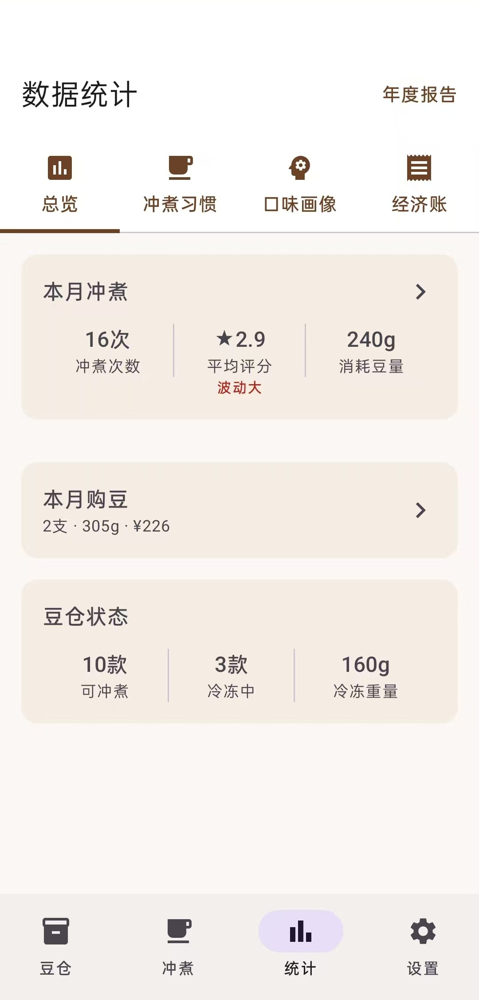
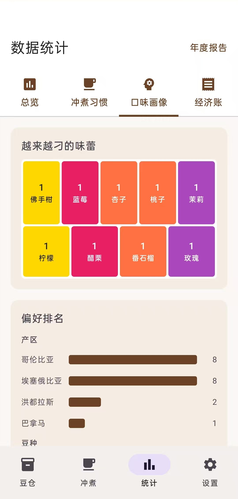
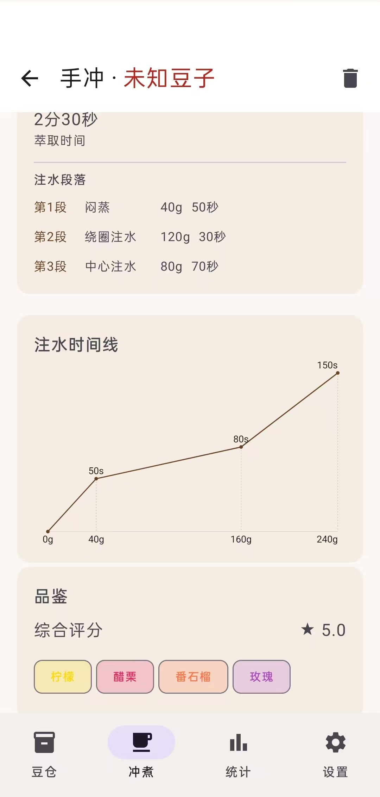
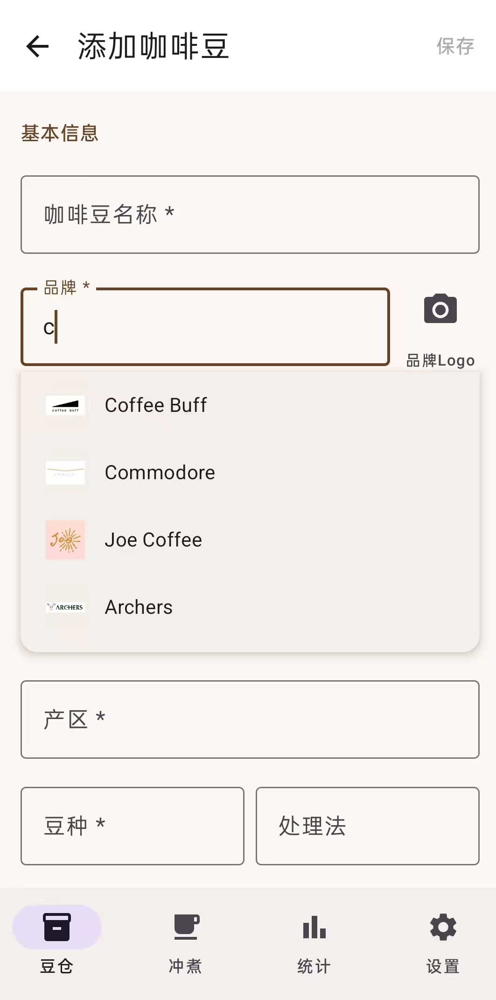
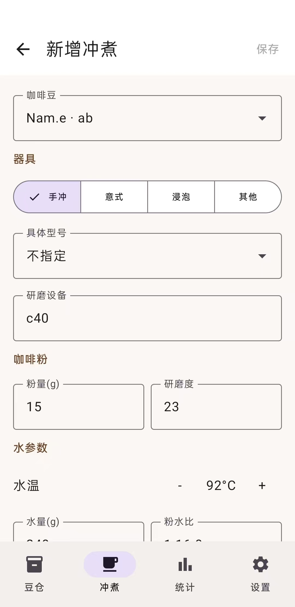
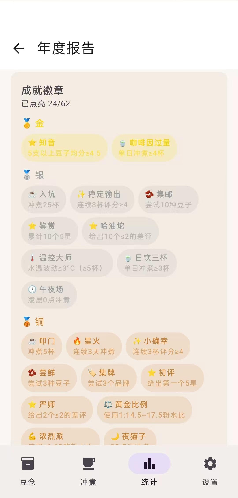

# 豆仓 ☕

> 记录每一杯冲煮，品味每一段旅程

豆仓是一款专为手冲咖啡爱好者打造的本地记录应用。从豆子管理到冲煮记录，从风味图谱到年度报告，帮你构建完整的咖啡数据世界。

---

## 核心功能

### 🫘 豆仓管理
- 完整的豆子档案：品牌、产地、品种、处理法、海拔、烘焙度
- 智能养豆追踪：养豆期倒计时、最佳赏味期、冷冻管理
- 库存预警系统：低库存自动提醒
- 品牌 Logo 自动匹配（支持 35+ 品牌预置 + 自定义上传）

### ☕ 冲煮记录
- 支持手冲、意式、浸泡等多种器具
- 详细参数记录：研磨度、水温、粉水比、注水方式
- 分段注水记录：闷蒸、绕圈、中心注水各阶段
- 五星评分 + 多维风味标签

### 📊 统计分析（四大维度）
- **总览**：本月冲煮数据、库存状态、购豆记录
- **冲煮习惯**：周历热力图、时间分布、设备排名、稳定性曲线
- **口味画像**：风味气泡图（10 大风味轮类别）、产地/豆种排名、季节偏好
- **经济账**：单杯成本、月度消费趋势、性价比排行、损耗率、消耗排行

### 📈 年度报告
- 年份滑动切换（2020~2026）
- 咖啡人格称号系统（段位 + 器具 + 风味三段式动态生成）
- Top 3 豆子 + 年度品牌（带 Logo）
- 风味 DNA 气泡图（10 大风味轮类别）
- 花费总结：年度总花费、单杯成本、损耗成本
- **60+ 枚成就徽章**：铜/银/金/钻四等级，覆盖冲煮、连续、品鉴、探索、风味、器具、花费、时间、季节等 15 个类别
- 新成就实时弹窗提醒

---

---

## 截图

| 数据总览 | 口味画像 | 冲煮详情 |
|---------|---------|---------|
|  |  |  |

| 豆子编辑 | 新增冲煮 | 成就徽章 |
|---------|---------|---------|
|  |  |  |

---

## 下载

### 直接下载 APK
→ [beanbox_v1.0.1.apk](androidApp/beanbox_v1.0.1.apk)

> 首次安装需开启「允许安装未知来源应用」

---

## 数据安全

- **完全本地**：所有数据存储在设备本地数据库，无云端同步
- **无网络权限**：应用不联网，你的咖啡数据不会上传到任何服务器
- **无广告无追踪**：纯净的个人工具

---

## 已知问题

### ColorOS 上动画异常

在 OPPO等 ColorOS 系统上，部分页面可能出现动画卡顿或闪烁。

**解决方法：** 进入「设置 → 关于手机 → 连续点击版本号7次 → 开发者选项」，将「动画程序时长缩放」设为关闭。

> 这是 ColorOS 系统对 Compose 动画的兼容性问题，不影响数据和功能。

---

## 未来计划

- [ ] 批量导入/导出数据
- [ ] 多设备同步（可选）
- [ ] 冲煮对比功能
- [ ] 自定义风味标签
- [ ] iPad 适配

---

## License

MIT License - 自由使用、分发
